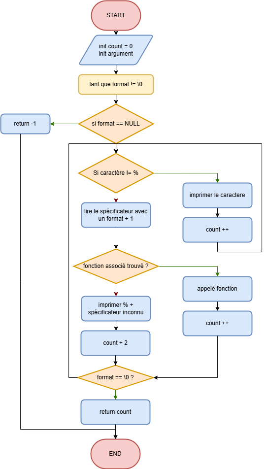

# 🖨️ Custom `_printf` — C Language Project (Holberton School)

A modular, clean, and professional re‑implementation of the C standard library function `printf`.  
This project demonstrates mastery of variadic functions, string parsing, function pointers, and low‑level output.

---

## 📌 Table of Contents
- [Overview](#overview)
- [Features](#features)
- [Supported Format Specifiers](#supported-format-specifiers)
- [Project Architecture](#project-architecture)
- [Flowchart](#flowchart)
- [How `_printf` Works](#how-_printf-works)
- [Compilation](#compilation)
- [Usage Examples](#usage-examples)
- [Return Value](#return-value)
- [Current Limitations](#current-limitations)
- [Authors](#authors)

---

## 📖 Overview

This project is a custom implementation of the classic `printf` function.  
It replicates core behaviors such as format parsing and variadic argument handling, while maintaining a modular and expandable code structure.

The goal is pedagogical: to deeply understand  
- how formatted printing works,  
- how `va_list` is used,  
- how dispatch tables (struct + function pointer) work,  
- how to build scalable low‑level C programs.

---

## ✨ Features

- Clean and professional architecture  
- Fully modular components  
- Dispatch table for specifier–function mapping  
- Accurate counting of printed characters  
- Graceful handling of invalid format specifiers  
- No use of the standard `printf` or related functions  

---

## 🔤 Supported Format Specifiers

| Specifier | Meaning                         | Example Output |
|-----------|----------------------------------|----------------|
| `%c`      | Print a character                | `A`            |
| `%s`      | Print a string                   | `Hello`        |
| `%%`      | Print a literal percent sign     | `%`            |

Additional specifiers can easily be added by extending the dispatch table.

---

## 🗂️ Project Architecture

```
holbertonschool-printf/
│
├── _printf.c          # Core printf logic
├── get_func.c         # Selector for specifier handlers
├── print_char.c       # Handler for %c
├── print_string.c     # Handler for %s
├── print_percent.c    # Handler for %%
├── _putchar.c         # Low-level output using write()
│
└── main.h             # Header: structs, prototypes, system includes
```

---

## 📊 Flowchart

The execution flow of `_printf` is represented below:



---

## 🧠 How `_printf` Works

1. Validate the input format string  
2. Initialize the variadic argument list  
3. Iterate through each character in the format string  
4. If the character is not `%`, print it directly  
5. If `%` is found:  
   - Read the next character (specifier)  
   - Look up the correct handler in the dispatch table  
   - Call the handler if found  
   - Otherwise print `%` + the unknown specifier  
6. Keep track of all printed characters  
7. Return the total count  

---

## 🛠️ Compilation

Compile using:

```bash
gcc -Wall -Wextra -Werror -pedantic *.c -o printf_test
```

Run:

```bash
./printf_test
```

---

## 🧪 Usage Examples

```c
_printf("Hello %s %c %%!\n", "World", 'X');
```

**Output:**
```
Hello World X %!
```

---

```c
_printf("Character: %c\n", 'A');
```

**Output:**
```
Character: A
```

---

```c
_printf("String: %s\n", "Holberton");
```

**Output:**
```
String: Holberton
```

---

## 🔙 Return Value

`_printf` returns:
- The **total number of printed characters**  
- `-1` if `format` is `NULL`  
- `-1` if `%` is the last character in the string  

---

## 👨‍💻 Authors

Developed by:

- **Lorenzo ANSELME**  
- **Esteban CALLEJO**  

Holberton School — Low-Level Programming.

---
